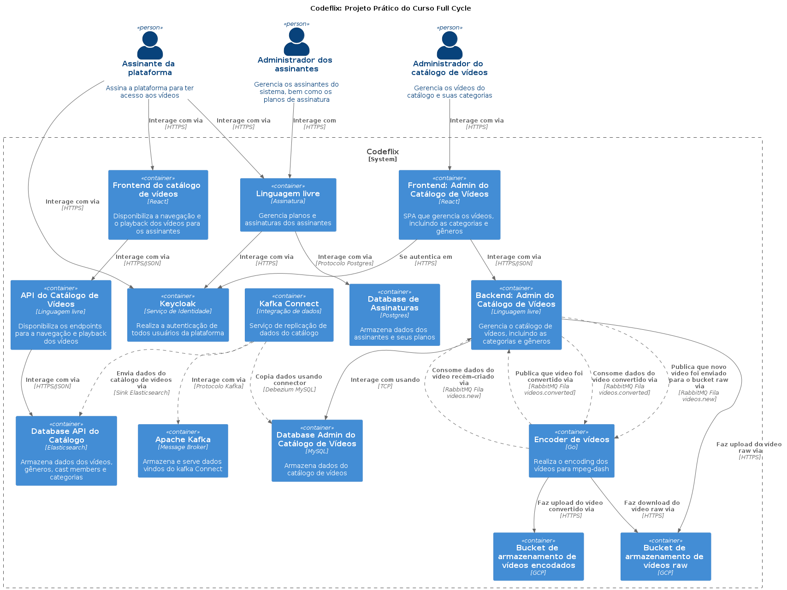

# Projeto FC

[Gestão de tarefas](https://github.com/lucassimon/fc-k8s)

## Visao geral

## Infra

TODO: Fazer diagramas

## keycloack

[Getting started docker](https://www.keycloak.org/getting-started/getting-started-docker)

[Admin api](https://www.keycloak.org/docs-api/17.0/rest-api/index.html#_users_resource)

[Postman Collection](https://documenter.getpostman.com/view/7294517/SzmfZHnd#6a5f4ee3-9454-4387-83a7-aac067b7af44)

https://github.com/codeedu/live-imersao-fullcycle10-next-clean-arch/tree/main/src/%40core/infra

https://github.com/codeedu/live-multi-tenancy-nest-next-keycloak
